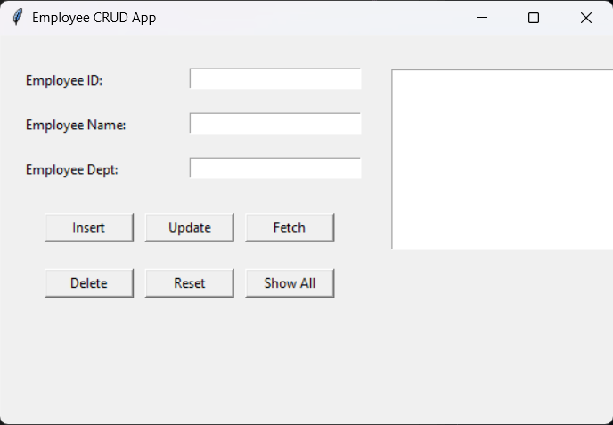

# Employee CRUD Application

## Overview

Employee CRUD Application is a desktop database management tool built with **Python, Tkinter, and MySQL**. The application provides a graphical interface that allows users to create, retrieve, update, and delete employee records stored in a relational database.

The system connects securely to a MySQL database using environment variables and enables basic employee data management through a simple GUI.

This project demonstrates practical usage of:

* Python database integration
* GUI development with Tkinter
* SQL CRUD operations
* Secure configuration using environment variables
* Input validation and error handling

The application interacts directly with a MySQL database table and dynamically updates employee records.

---

## Project Screenshots

### Application Interface




### Employee Records Display


---

## Features

### Employee Record Management

The application performs full **CRUD operations** on employee records stored in a MySQL database.

CRUD stands for:

| Operation | Description                 |
| --------- | --------------------------- |
| Create    | Add new employee records    |
| Read      | Fetch employee data         |
| Update    | Modify employee information |
| Delete    | Remove employee records     |

Each employee record contains:

* Employee ID
* Employee Name
* Employee Department

---

### Database Connection

The system connects to a MySQL database using credentials stored in environment variables for security.

Connection parameters are loaded using `python-dotenv`.

Example connection function:

```python
def get_connection():
    return mysql.connector.connect(
        host=os.getenv("DB_HOST"),
        user=os.getenv("DB_USER"),
        password=os.getenv("DB_PASS"),
        database=os.getenv("DB_NAME")
    )
```

This prevents sensitive information from being stored directly in the source code.

---

### Insert Employee

Users can add new employee records through the GUI.

The application validates input fields and executes an SQL INSERT query.

Example query:

```sql
INSERT INTO empDetails (empId, empName, empDept)
VALUES (%s, %s, %s)
```

After successful insertion, the database transaction is committed.

---

### Fetch Employee Data

Users can retrieve employee information by entering an employee ID.

The application queries the database and automatically fills the form fields with retrieved data.

Example query:

```sql
SELECT empName, empDept
FROM empDetails
WHERE empId = %s
```

---

### Update Employee Records

Existing employee records can be updated through the interface.

Example SQL query:

```sql
UPDATE empDetails
SET empName=%s, empDept=%s
WHERE empId=%s
```

If the employee ID does not exist, the system informs the user.

---

### Delete Employee Records

Employees can be removed from the database by providing their ID.

Example SQL query:

```sql
DELETE FROM empDetails
WHERE empId=%s
```

The application confirms whether a record was successfully deleted.

---

### Display All Employees

The system can retrieve and display all employee records stored in the database.

Example query:

```sql
SELECT * FROM empDetails
```

Results are displayed inside a Tkinter **Listbox** widget.

---

## GUI Implementation

The graphical interface is built using **Tkinter**, Python’s standard GUI toolkit.

Main components include:

* Labels for field descriptions
* Entry widgets for user input
* Buttons for CRUD operations
* A Listbox for displaying database records

Key interface elements:

| Component         | Purpose                       |
| ----------------- | ----------------------------- |
| Employee ID Entry | Input employee identifier     |
| Name Entry        | Input employee name           |
| Department Entry  | Input employee department     |
| Insert Button     | Add new employee              |
| Update Button     | Modify employee record        |
| Fetch Button      | Retrieve employee information |
| Delete Button     | Remove employee record        |
| Show All Button   | Display all employees         |
| Listbox           | Show database records         |

---

## Project Structure

```
Employee-CRUD-App
│
├── Employee CRUD app - final.py
├── myenv_path.env
├── images/
│   ├── App-Interface.png
│   └── employee-records.png
└── README.md
```

---

## How to Run the Project

### 1. Clone the repository

```
git clone https://github.com/yourusername/Employee-CRUD-App.git
```

### 2. Navigate to the project directory

```
cd Employee-CRUD-App
```

### 3. Install required dependencies

```
pip install mysql-connector-python python-dotenv
```

### 4. Configure environment variables

Create a `.env` file in the project directory:

```
DB_HOST=localhost
DB_USER=your_username
DB_PASS=your_password
DB_NAME=your_database
```

---

### 5. Run the application

```
mployee CRUD app - final.py
```

Python 3.8 or newer is recommended.

---

## Example Workflow

1. Launch the application
2. Enter employee information
3. Click **Insert** to add a new record
4. Use **Fetch** to retrieve existing employee data
5. Modify fields and click **Update** to save changes
6. Click **Delete** to remove an employee record
7. Use **Show All** to display the entire employee table

---

## Technologies Used

* **Python 3**
* **Tkinter** – graphical user interface
* **MySQL** – relational database
* **mysql-connector-python** – Python database driver
* **python-dotenv** – environment variable management
* **SQL** – database query language

---

## Learning Objectives

This project was developed to practice:

* Python database integration
* Implementing SQL CRUD operations
* Building GUI database tools
* Input validation and error handling
* Secure configuration management

---

## Possible Improvements

Future enhancements could include:

* Employee search functionality
* Pagination for large datasets
* Role-based access control
* Data export to CSV or Excel
* Improved GUI styling
* REST API integration

---

## Author

Pouya Nasraei
Python Developer | Software Engineer
