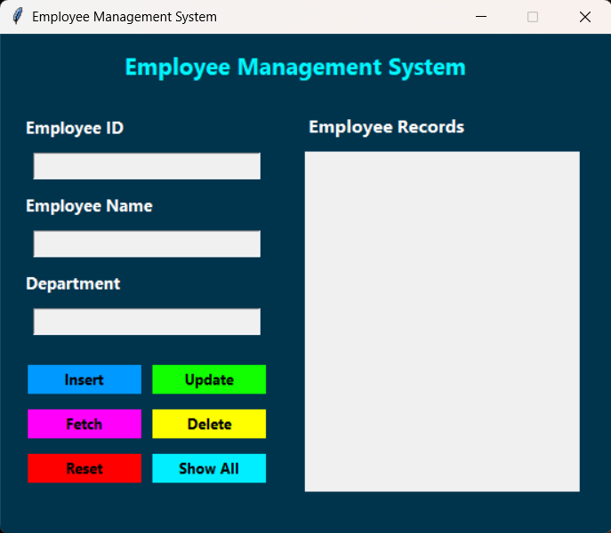
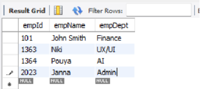

# Employee Management System (GUI + REST API)

## Overview

Employee Management System is a Python application that demonstrates full **CRUD (Create, Read, Update, Delete)** operations using both a **desktop graphical interface** and a **REST API**.

The project integrates:

* **Python**
* **Tkinter GUI**
* **Flask REST API**
* **MySQL database**
* **Environment variables for secure configuration**
* **Application logging**

The system allows employee records to be managed through a desktop interface or programmatically via HTTP API endpoints.

This project demonstrates real-world backend architecture concepts including **modular code design**, **database abstraction**, and **multi-interface applications**.

---

## Project Screenshots

### Application Interface



### Employee Records Display



---

# Features

## Employee CRUD Operations

The system performs complete **Create, Read, Update, and Delete** operations on employee records stored in a MySQL database.

| Operation | Description                          |
| --------- | ------------------------------------ |
| Create    | Add new employee records             |
| Read      | Retrieve employee data               |
| Update    | Modify existing employee information |
| Delete    | Remove employee records              |

Each employee record contains:

* Employee ID
* Employee Name
* Employee Department

---

# Dual Interface Architecture

The project provides **two different ways to interact with the system**.

### 1. Desktop GUI (Tkinter)

A graphical user interface allows users to manage employee records through buttons and form fields.

Available actions:

* Insert employee
* Fetch employee by ID
* Update employee information
* Delete employee
* Display all employees

---

### 2. REST API (Flask)

The application also exposes a **RESTful API** for programmatic access.

| Method | Endpoint          | Description             |
| ------ | ----------------- | ----------------------- |
| GET    | `/employees`      | Retrieve all employees  |
| GET    | `/employees/<id>` | Retrieve employee by ID |
| POST   | `/employees`      | Create new employee     |
| PUT    | `/employees/<id>` | Update employee         |
| DELETE | `/employees/<id>` | Delete employee         |

Example API response:

```json
{
  "id": 101,
  "name": "John Smith",
  "dept": "Finance"
}
```

This allows the system to function as a **backend service** for other applications.

---

# Application Logging

The application logs system activity into a log file:

```
logs/app.log
```

Example log entries:

```
2026-03-11 20:15:30 - INFO - Application started
2026-03-11 20:16:02 - INFO - Inserted employee 101
2026-03-11 20:16:15 - INFO - Updated employee 101
```

Logging helps track system events and assists debugging.

---

# Database Structure

The project uses a MySQL database containing the following table:

```sql
CREATE TABLE empDetails (
    empId INT PRIMARY KEY,
    empName VARCHAR(100) NOT NULL,
    empDept VARCHAR(100) NOT NULL
);
```

A setup script is included:

```
employees.sql
```

This script creates the database and required table.

---

# Project Architecture

The application is organized into multiple modules to separate responsibilities.

```
Employee-Management-System
│
├── api.py              # Flask REST API
├── main.py             # Application entry point
├── gui.py              # Tkinter graphical interface
├── functions.py        # Business logic (CRUD operations)
├── data.py             # Database connection module
│
├── employees.sql       # Database initialization script
├── myenv_path.env      # Environment variables
├── requirements.txt    # Python project dependencies
│
├── logs/
│   └── app.log         # Application logs
│
└── README.md
```

This modular architecture separates:

* **User interface**
* **Business logic**
* **Database access**
* **API services**

This structure improves maintainability and scalability.

---

# Installation

## 1. Clone the repository

```
git clone https://github.com/yourusername/employee-management-system.git
```

```
cd employee-management-system
```

---

# Install Dependencies

```
pip install flask mysql-connector-python python-dotenv
```
```
pip install -r requirements.txt
```
---

# Configure Environment Variables

Edit the environment file:

```
myenv_path.env
```

Example configuration:

```
DB_HOST=localhost
DB_USER=root
DB_PASS=your_password
DB_NAME=employee
```

These variables allow the application to connect securely to the database.

---

# Setup the Database

Run the provided SQL script:

```
employees.sql
```

Example using MySQL CLI:

```
mysql -u root -p < employees.sql
```

This will create the required database and table.

---

# Running the Application

## Run the Desktop Application

```
python main.py
```

---

## Run the REST API

```
python api.py
```

The API will start at:

```
http://127.0.0.1:5000
```

---

# Example API Request

Retrieve all employees:

```
GET http://127.0.0.1:5000/employees
```

Create an employee:

```
POST /employees
```

Example request body:

```json
{
  "id": 101,
  "name": "Alice",
  "dept": "Finance"
}
```

---

# Technologies Used

* **Python 3**
* **Tkinter** – desktop GUI framework
* **Flask** – REST API framework
* **MySQL** – relational database
* **mysql-connector-python** – Python MySQL driver
* **python-dotenv** – environment configuration
* **Logging module** – application logging

---

# Learning Objectives

This project demonstrates:

* Python modular programming
* Database integration with MySQL
* REST API development using Flask
* GUI development with Tkinter
* Logging and error tracking
* Environment-based configuration
* Separation of concerns in software architecture

---

# Possible Future Improvements

* API authentication
* Employee search endpoint
* Pagination for large datasets
* Docker containerization
* Frontend web interface
* Unit testing with PyTest
* ORM integration (SQLAlchemy)

---

# Author

Pouya Nasraei
Python Developer | Software Engineer
